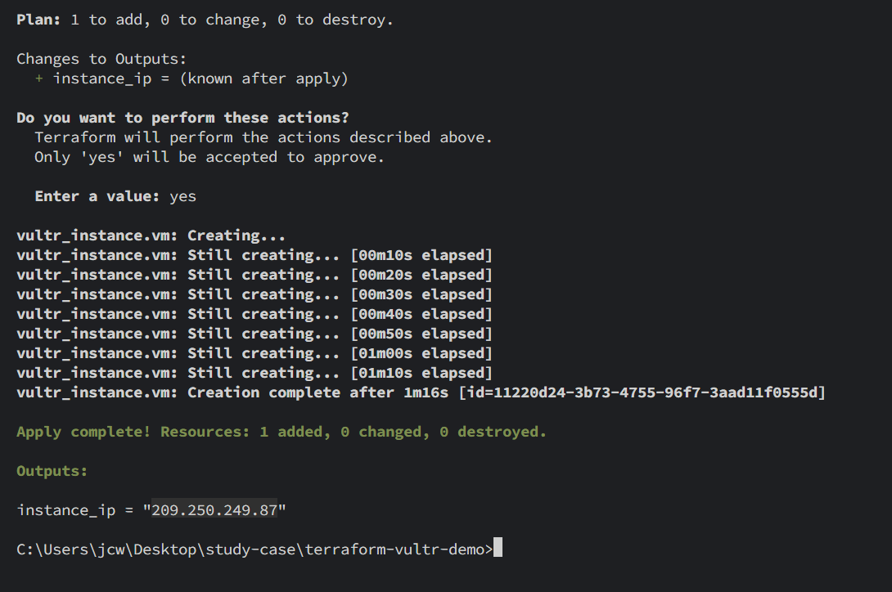
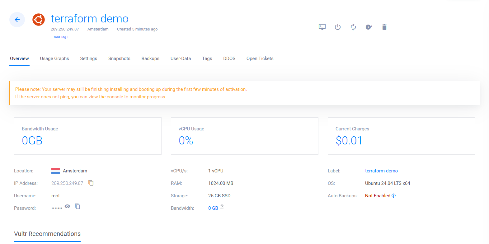

# Infrastructure as Code with Vultr

[](https://www.terraform.io/)
[](https://www.vultr.com/)
[](https://opensource.org/licenses/MIT)

This is a basic Infrastructure as Code (IaC) demo leveraging Terraform to automate the provisioning of resources on Vultr.
It sets up a single Virtual Private Server (VPS) and configures essential firewall rules, demonstrating full automation.

## 🚀 What it does:

- **Provisions a Vultr Instance:**
  - 📀 **OS:** Ubuntu 24.04
  - 💻 **Configuration:** 1vCPU, 1GB RAM, 25GB SSD
  - 🌍 **Location:** Amsterdam (AMS)
- **Attaches Firewall Rules:**
  - 🧱 Opens essential ports: `22` (SSH) and `80` (HTTP).

## 🧠 How to use:

1.  **Install Terraform:** Ensure you have Terraform installed.
2.  **Export Your Vultr API Key:**
    Replace `your_api_key_here` with your actual Vultr API key. This is crucial for Terraform to authenticate with Vultr.
    ```bash
    export TF_VAR_vultr_api_key=your_api_key_here
    ```
3.  **Clone the Repository:**
    ```bash
    git clone https://github.com/aleixnguyen-vn/iac-vultr-terraform.git
    cd iac-vultr-terraform # Navigate into the cloned directory
    ```
4.  **Run Terraform Commands:**
    ```bash
    terraform init      # Initialize Terraform working directory
    terraform plan      # Review the planned infrastructure changes
    terraform apply     # Apply the configuration to provision resources
    ```
5.  **Clean Up (Optional):**
    To destroy the provisioned resources and avoid charges:
    ```bash
    terraform destroy
    ```

## 🖼️ Screenshots

### 1. Terraform `apply` Output
*Confirmation of successful VPS and firewall provisioning from the terminal.*



### 2. Vultr Dashboard - Newly Provisioned VPS
*Verify the instance details and status directly from the Vultr control panel.*



## ⚠️ Important Notes:

* **Security:** Never hardcode your API key directly into your `main.tf` or commit it to version control. Use environment variables as shown.